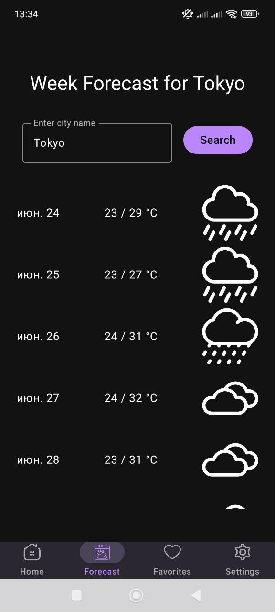
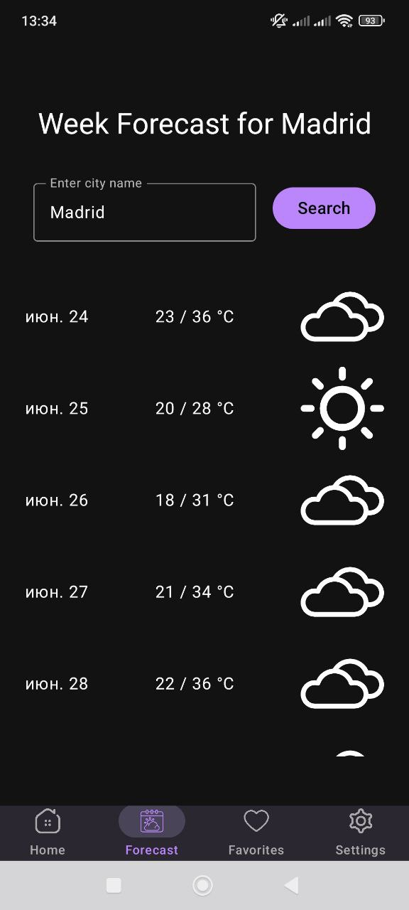
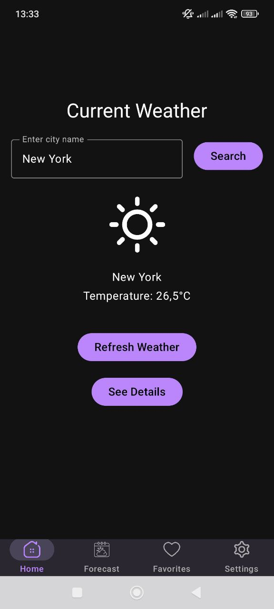
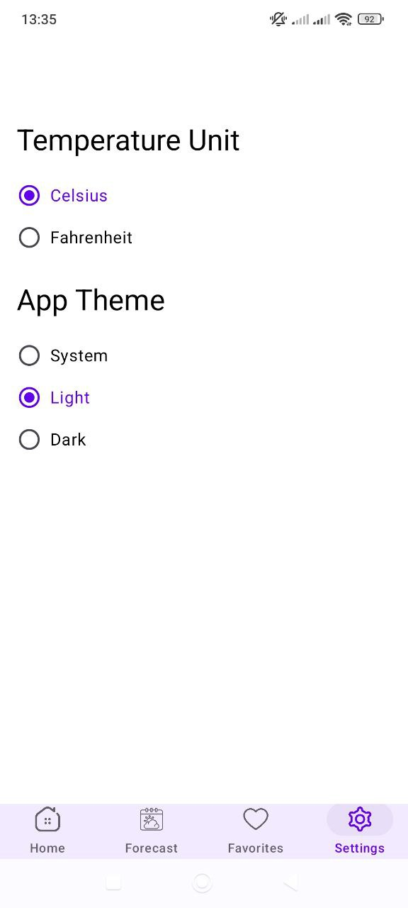
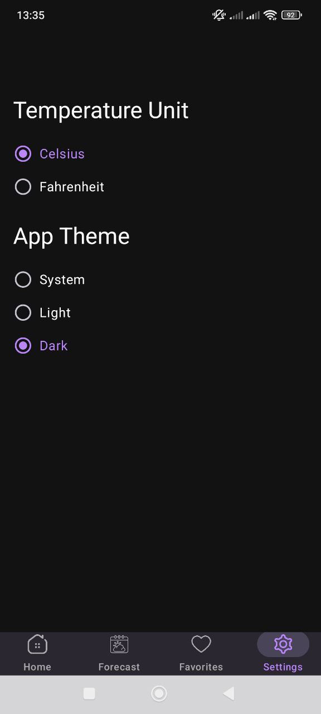
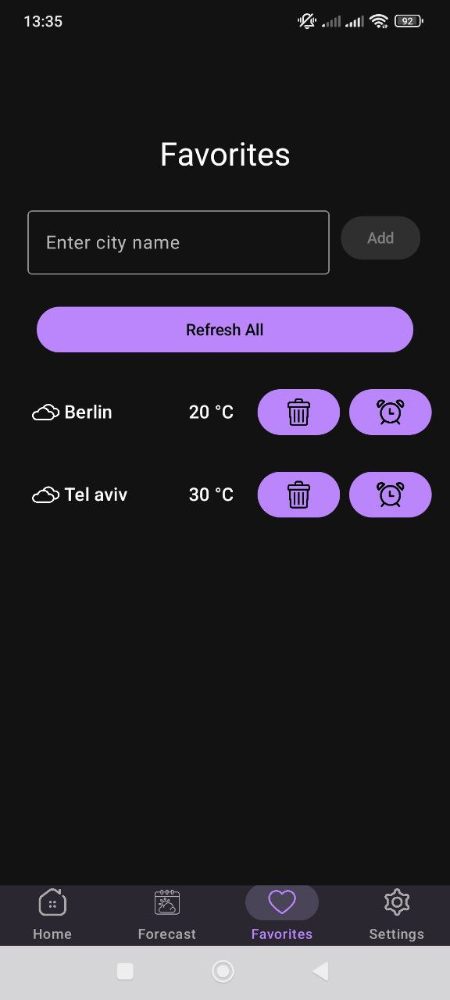

# WeatherApp 🌤️

## Popis projektu 📋

WeatherApp je mobilní aplikace pro Android vyvinutá v **Kotlinu** s využitím **Jetpack Compose** pro uživatelské rozhraní. Aplikace poskytuje aktuální informace o počasí, předpověď na týden a možnost správy oblíbených měst. Uživatelé mohou získat data o počasí na základě své polohy nebo vyhledáváním konkrétních měst. Aplikace podporuje přizpůsobitelné nastavení, jako je volba jednotek teploty (Celsius nebo Fahrenheit) a výběr motivu (světlý, tmavý nebo systémový). 😊

## Hlavní funkce ✨

- **Aktuální počasí** ☀️: Zobrazení aktuální teploty, vlhkosti, tlaku, rychlosti a směru větru, východu a západu slunce pro vybrané město nebo aktuální polohu.
- **Předpověď na týden** 📅: Sedmidenní předpověď s minimálními a maximálními teplotami a informacemi o počasí.
- **Oblíbená města** ❤️: Možnost přidávat, odstraňovat a zobrazovat počasí pro oblíbená města s podporou upozornění na počasí.
- **Nastavení** ⚙️: Přizpůsobení jednotek teploty a motivu aplikace.
- **Podpora polohy** 📍: Automatické načítání počasí pro aktuální polohu uživatele po udělení příslušných oprávnění.
- **Upozornění na počasí** 🔔: Možnost nastavení upozornění pro konkrétní město v určitý čas.

## Architektura a technologie 🛠️

### Architektura
- **MVVM (Model-View-ViewModel)** 🗂️: Použita pro oddělení logiky uživatelského rozhraní od datové vrstvy.
- **Repository Pattern** 📦: Zajišťuje centralizované získávání dat z API a místní databáze.
- **Room Database** 💾: Ukládání oblíbených měst do místní databáze.
- **Retrofit** 🌐: Síťové volání pro získávání dat o počasí a geolokaci.
- **Jetpack Compose** 🎨: Moderní toolkit pro tvorbu uživatelského rozhraní.
- **Coroutines a Flow** 🚀: Asynchronní programování pro správu síťových požadavků a aktualizací uživatelského rozhraní.

### Použité API
- **Open-Meteo API** ☁️: Poskytuje data o aktuálním počasí a předpovědi.
- **Nominatim (OpenStreetMap)** 🗺️: Použito pro geokódování (převod názvu města na souřadnice) a reverzní geokódování (převod souřadnic na název města).

### Struktura projektu 📁
- **`data/api`** 🔌: Obsahuje rozhraní pro API (WeatherApi, GeoApi) a konfiguraci Retrofit klienta.
- **`data/dao`** 🗄️: Rozhraní pro Room databázi (CityDao) pro správu oblíbených měst.
- **`data/database`** 💽: Konfigurace Room databáze (AppDatabase).
- **`data/entity`** 📋: Datová entita pro Room (CityEntity).
- **`data/model`** 📊: Datové modely pro odpovědi z API (GeoResponse, WeatherResponse, ReverseGeoResponse).
- **`data/repository`** 🗃️: Repozitáře pro správu dat (WeatherRepository, CityRepository).
- **`ui/navigation`** 🧭: Navigace v aplikaci s použitím NavHost a bottom navigation.
- **`ui/screen`** 🖼️: Composable obrazovky (HomeScreen, DetailScreen, ForecastScreen, FavoritesScreen, SettingsScreen).
- **`util`** 🛠️: Pomocné třídy a funkce (WeatherUtils, ValidationUtil, PreferencesManager, LocationUtil).

## Instalace a spuštění 🚀
1. Naklonujte repozitář
2. Otevřete projekt v Android Studio. 🛠️
3. Synchronizujte projekt s Gradle. 🔄
4. Spusťte aplikaci na emulátoru nebo fyzickém zařízení. 📱

## Screenshots

